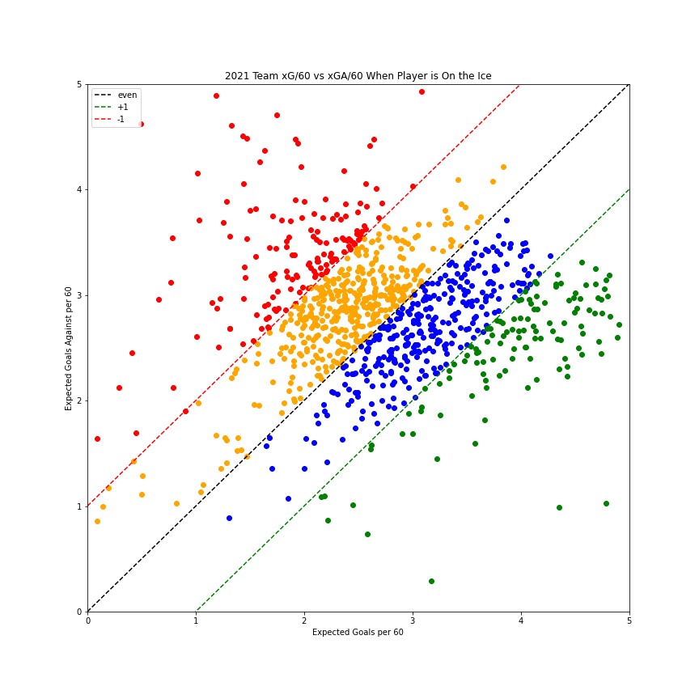

<h1>Clustering NHL Players by their teams xG vs xGA</h1>

Expected goals(xG) is a statistic used in hockey to give shots value. It gives you the probability that each shot has of becoming a goal based on a list of features. I have created my own expected goals model, but in this project I am using data from <a href = "moneypuck.com">Money Puck</a>.
I clustered the players by the net value of xG and expected goals against(xGA) that their team had when they were on the ice per every 60 minutes of icetime. Essentially, if you are a player, you want your team to have more expected goals than you have expected goals against.

I put the players into four different categories. Green being the best followed by blue, yellow, and red. I orginally tried using SciKit Learn to cluster the data, but it wasn't clustering them in the way I had intended. Instead, I wanted to cluster with a 45 degree line because this would better show their net value. 
To get these categories I calculated the net difference of xG/60 AND XGA/60, and then made four bins: under 1, between -1 and 0, between 0 and 1, and over 1. 
The closer the player is to the bottom right corner of the graph the better their net value is, but anywhere below the black dotted line is good.

